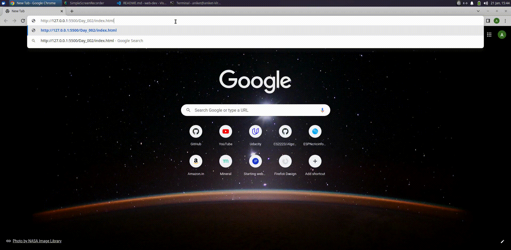
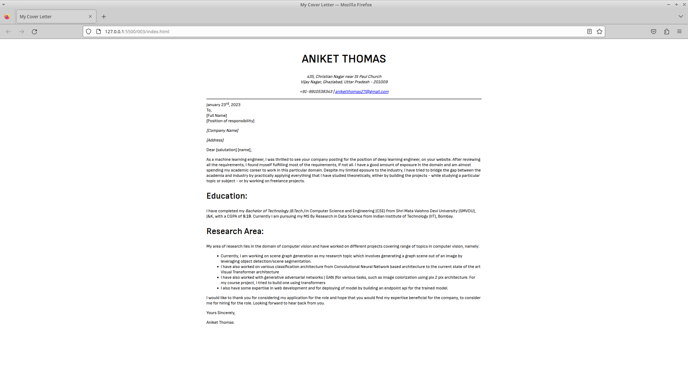
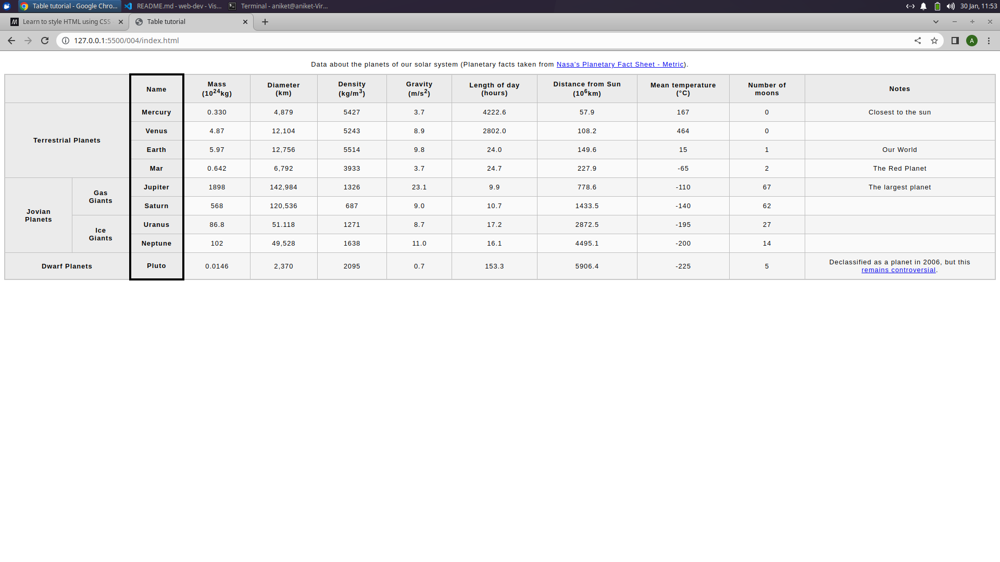
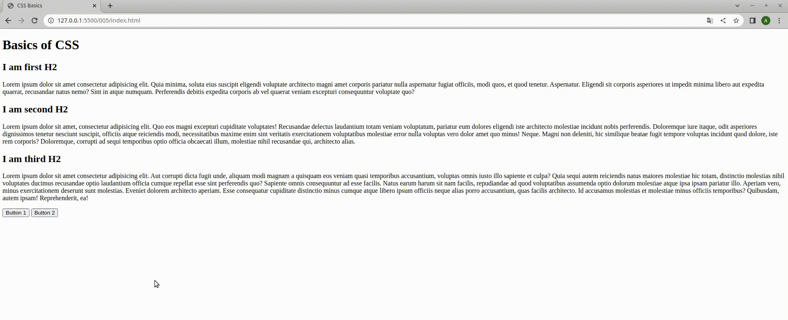

# web_dev_learn

__A log of my progress while learning web development in 2023.__

- __DAY 01:__ Built a basic webpage while learning from (https://developer.mozilla.org/en-US/docs/Learn/Getting_started_with_the_web/JavaScript_basics)

- __DAY 02:__ Learnt about HTML in depth (Some tags present in the head tag that are used for meta content of web such as title, favicon, linking spreadsheet, scripts, adding meta tag, etc.) and also some of the body tags such as headers, paragraph, lists, etc.

- __DAY 03:__ Completed Introduction to html from (https://developer.mozilla.org/en-US/docs/Learn/HTML/Introduction_to_HTML) which involves learning some semantic tags, how to structure the webpage and how to use appropriate tags for better accessibility to all user. Also structured a cover letter as part of an assignment.

- __DAY 04:__ Studied about adding multimedia in the html and improve the user accessibility using figure tag. Also learnt to embed the content. Started learning about tables. 

- __Day 05:__ Studied about responsive image design using html, the usage of srcset and sizes attribute in img tag. Also picture tag to include multiple images and choose according to the width of the device. Learnt a bit about security issues with using iframe and importance of sandbox attribute in iframe from (https://developer.mozilla.org/en-US/docs/Learn/HTML/Multimedia_and_embedding/Other_embedding_technologies / https://developer.mozilla.org/en-US/docs/Learn/HTML/Multimedia_and_embedding/Responsive_images)

- __Day 06:__ Finished with all important tags of html, learned some accessibility tags for the table. Did the assignment of building a table and used the stylesheet, provided by mdn (https://github.com/mdn/learning-area/blob/main/html/tables/basic/minimal-table.css), for styling it (Studied from: https://developer.mozilla.org/en-US/docs/Learn/HTML). Also Started basic CSS.

- __Day 07:__ Started diving deep into CSS. Watched the video why CSS is weird (Link: https://youtu.be/aHUtMbJw8iA). Learnt about color representation in rgb, hex code for text color and background color. Also studied about text formatting.

